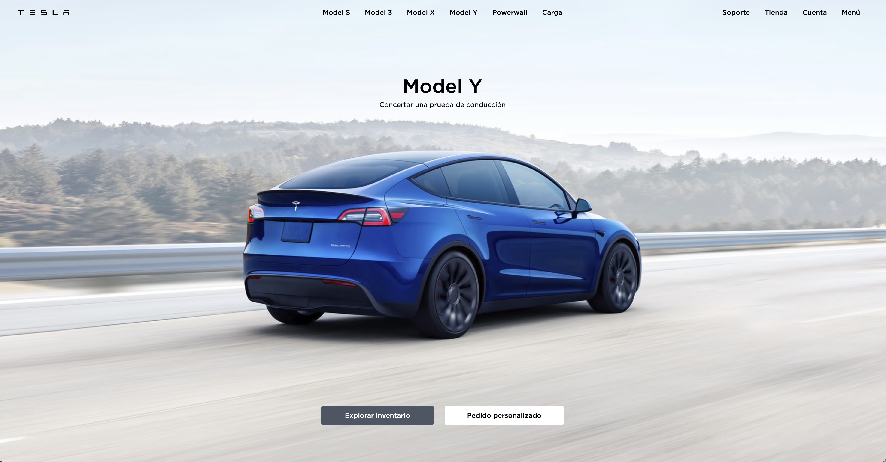

## [Live Web](https://tesla-astro.netlify.app/)

### Project Showcase 🚀: Tesla Landing Page Clone

Thrilled to share my recent project, inspired by the sleek design of the Tesla website. With guidance from @Midudev, I've mastered crafting a landing page using the cutting-edge #AstroFramework. 🌌

But that's not all! 🌟 I've also implemented a smooth slider solely with #TailwindCSS, utilizing the snap mandatory property. What's even cooler? Mastering the CSS currentColor variable to dynamically alter the header text color based on the section it's hovering over. A true blend of aesthetics and functionality!

Eager to dive deeper into the tech world and create more of such engaging designs. Let's connect and innovate! 🔗🌐

#WebDevelopment #TeslaClone #FrontEndDevelopment #WebDesign #CodingJourney

(Note: Always ensure to give credit when using someone else's work as a base or inspiration. If the mentioned @Midudev provided resources or tutorials, it's respectful and professional to acknowledge them.)

